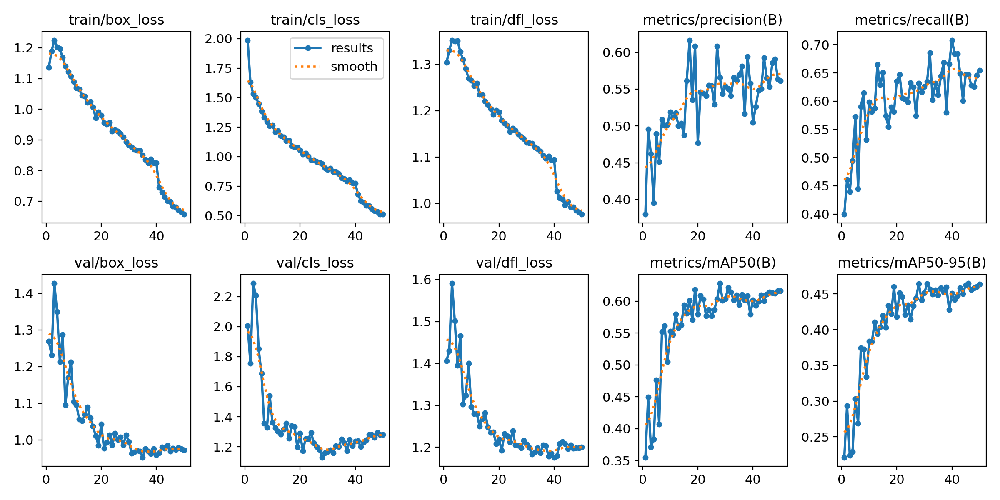

# Plant Pulse Vision Dashboard

## 설계 로직 & 전체 동작 개요
1. 센서(토양 습도/온도)와 카메라가 데이터를 수집합니다.
2. Raspberry Pi에서 로컬 YOLO/ONNX 분석으로 잎 개수, 높이, 황화 비율을 계산합니다.
3. 이상징후가 감지되면 **해당 이상 내용**을 포함해 Gemini로 정밀 진단을 요청합니다.
4. FastAPI가 센서/사진/분석 결과를 SQLite에 저장합니다.
5. Streamlit 대시보드가 최신 상태와 진단 결과를 시각화합니다.



이 프로젝트는 **Raspberry Pi(Linux) 배포**를 목표로 하는 식물 모니터링 시스템입니다. 개발은 Windows에서 진행하되, 모든 실행 환경은 Linux 호환을 기준으로 설계했습니다.

## 프로젝트 소개
- 카메라 이미지와 센서 데이터를 통합해 식물 상태를 실시간으로 분석합니다.
- 로컬 AI가 이상징후를 1차 감지하고, Gemini가 정밀 진단을 수행합니다.
- 모든 결과는 SQLite에 저장되고, 대시보드에서 확인합니다.

## 핵심 구성 요소
- **FastAPI API**: 센서 데이터/이미지 업로드/분석 요청 수신 및 저장
- **Streamlit 대시보드**: 최신 상태, 분석 결과, 이력 조회
- **로컬 AI(Local YOLO/ONNX)**: 잎/높이/황화 비율 기반 이상징후 1차 감지
- **시리얼 리스너**: Arduino JSON 수신 → API 전달 (ACK/NACK + 재시도)
- **SQLite**: 센서 로그, 분석 결과, 이미지 메타 저장

## 배포 (Raspberry Pi / Linux)
```bash
python3 -m venv .venv
source .venv/bin/activate
pip install -r requirements.txt
python -m app.start_project
```

실행 후 주소:
- API: http://127.0.0.1:8000/api/health
- Dashboard: http://127.0.0.1:8501

## 환경 변수
| 변수 | 설명 | 예시 |
| --- | --- | --- |
| `GEMINI_API_KEY` | Gemini API 키 (필수) | `export GEMINI_API_KEY="YOUR_KEY"` |
| `SERIAL_PORT` | 시리얼 포트 (`/dev/ttyACM0`, `/dev/ttyUSB0`, `auto`) | `export SERIAL_PORT=auto` |
| `SERIAL_BAUD` | 시리얼 보드레이트 | `export SERIAL_BAUD=115200` |
| `SERIAL_TIMEOUT` | 시리얼 타임아웃(초) | `export SERIAL_TIMEOUT=1.0` |
| `SERIAL_RECONNECT_DELAY` | 재연결 대기(초) | `export SERIAL_RECONNECT_DELAY=5.0` |

## 로컬 AI 동작 요약
- 모델 경로: `weights/best.onnx` → 없으면 `weights/best.pt` → 최후 `yolov8n.pt`
- 분석 주기: 10분 (`app/local_AI.py`의 `sleep(600)`에서 조정)
- 이상징후 판단: 황화 비율/잎 감소/시듦 높이 변화
- 이상 발생 시 Gemini에 **이상 내용 포함**하여 정밀 진단 요청

## 주요 데이터 흐름
1. Arduino → 시리얼 JSON → `app/serial_listener.py` → `POST /api/external/sensor-data`
2. 카메라 캡처 → 로컬 AI 분석 → DB 저장 → 이상 시 Gemini 호출
3. 대시보드가 DB를 읽어 최신 상태 표시

## 주요 API
- `POST /api/external/sensor-data` : 외부 센서 데이터 수신
- `POST /api/external/watering-signal` : 급수 신호 수신
- `POST /api/plants/{plant_id}/analyze-photo` : 이미지 분석 요청
- `GET /api/kiosk/state` : 키오스크 상태 조회

## 프로젝트 구조
```
app/
  main.py                # FastAPI
  dashboard.py           # Streamlit
  local_AI.py            # 로컬 YOLO/ONNX 분석
  serial_listener.py     # Arduino 시리얼 수신
  services/              # 카메라/AI/DB 서비스
weights/
  best.onnx              # 학습된 YOLO 모델
results.png              # 학습 결과 이미지
src/
  auto_water_and_serial.ino  # Arduino 코드
```
